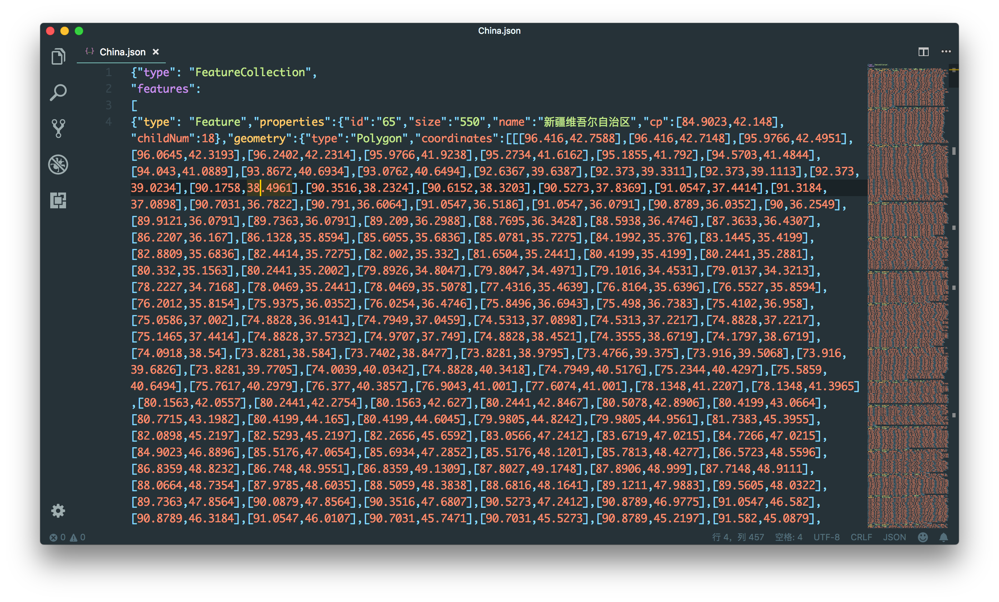

# 创建Shapefile文件并写入数据

作者：阿振

邮箱：tanzhenyugis@163.com

博客：<https://blog.csdn.net/theonegis/article/details/80089375>

修改时间：2018-06-02

声明：本文为博主原创文章，转载请注明原文出处

------

## 基本思路

使用GDAL创建Shapefile数据的基本步骤如下：

1. 使用`osgeo.ogr.Driver`的`CreateDataSource()`方法创建`osgeo.ogr.DataSource`矢量数据集
2. 使用`osgeo.ogr.DataSource`的`CreateLayer()`方法创建一个图层
3. 使用`osgeo.ogr.FieldDefn()`定义Shapefile文件的属性字段
4. 创建`osgeo.ogr.Feature`对象，设置每个属性字段的值，使用`Feature`对象的`SetGeometry()`定义几何属性
5. 创建`Feature`对象以后，使用`osgeo.ogr.Layer`的`CreateFeature()`添加`Feature`对象到当前图层
6. 重复步骤4和5依次添加所有的`Feature`到当前图层即可

## 代码实现

下面的例子中，我们读取GeoJSON表示的中国省区数据，然后其转为Shapefile格式。

GeoJSON编码片段如下：



可以看到每个Feature都有一个properties字段和geometry字段，我们需要根据properties字段的信息创建Shapefile数据的属性表，根据geometry字段创建Shapefile中的几何数据。

```Python
from osgeo import ogr
from osgeo import osr
import json
import os
os.environ['SHAPE_ENCODING'] = "utf-8"


with open('China.json') as f:
    china = json.load(f)

# 创建DataSource
driver = ogr.GetDriverByName('ESRI Shapefile')
ds = driver.CreateDataSource('China.shp')

# 创建WGS84空间参考
srs = osr.SpatialReference()
srs.ImportFromEPSG(4326)

# 创建图层
layer = ds.CreateLayer('province', srs, ogr.wkbPolygon)
# 添加属性定义
fname = ogr.FieldDefn('Name', ogr.OFTString)
fname.SetWidth(24)
layer.CreateField(fname)
fcx = ogr.FieldDefn('CenterX', ogr.OFTReal)
layer.CreateField(fcx)
fcy = ogr.FieldDefn('CenterY', ogr.OFTReal)
layer.CreateField(fcy)

# 变量GeoJSON中的features
for f in china['features']:
    # 新建Feature并且给其属性赋值
    feature = ogr.Feature(layer.GetLayerDefn())
    feature.SetField('Name', f['properties']['name'])
    feature.SetField('CenterX', f['properties']['cp'][0])
    feature.SetField('CenterY', f['properties']['cp'][1])

    # 设置Feature的几何属性Geometry
    polygon = ogr.CreateGeometryFromJson(str(f['geometry']))
    feature.SetGeometry(polygon)
    # 创建Feature
    layer.CreateFeature(feature)
    del feature
ds.FlushCache()

del ds
```

